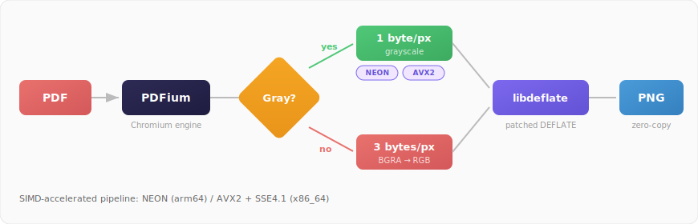

# fastpdf2png

Fast PDF to PNG converter. SIMD-optimized PNG encoding, automatic grayscale detection, multi-process scaling. MIT licensed.

[](LICENSE)
[]()

## Install

```bash
pip install fastpdf2png
```

Or build from source:
```bash
git clone https://github.com/nataell95/fastpdf2png.git && cd fastpdf2png
bash scripts/build.sh
```

## Usage

### CLI

```bash
./build/fastpdf2png input.pdf page_%03d.png 300 4 -c 2
```

### Python

```python
import fastpdf2png

images = fastpdf2png.to_images("doc.pdf")        # list of PIL images
fastpdf2png.to_files("doc.pdf", "output/")        # save PNGs to disk
data   = fastpdf2png.to_bytes("doc.pdf")          # raw PNG bytes
n      = fastpdf2png.page_count("doc.pdf")        # page count

# Batch processing — keep PDFium loaded between calls
with fastpdf2png.Engine() as pdf:
    for path in my_pdfs:
        images = pdf.to_images(path, dpi=150)
```

### Node.js

```js
const pdf = require("fastpdf2png");

pdf.toFiles("doc.pdf", "output/", { dpi: 150 });
const buffers = pdf.toBuffers("doc.pdf");
const count = pdf.pageCount("doc.pdf");

// Batch processing
const engine = new pdf.Engine();
await engine.toFiles("doc.pdf", "output/");
engine.close();
```

## Performance

71-page PDF (mixed: text, charts, tables, images) on Apple M3 Max. All tools single-process, compression level 2.

| Engine | 72 DPI | 150 DPI | 300 DPI | File size |
|--------|-------:|--------:|--------:|----------:|
| **fastpdf2png** | **531 pg/s** | **323 pg/s** | **145 pg/s** | **-38%** |
| MuPDF | 119 | 37 | 12 | baseline |
| PyMuPDF | 101 | 30 | 9 | baseline |

With multiple workers (150 DPI):

| Workers | Pages/sec |
|:-------:|----------:|
| 1 | 323 |
| 2 | 582 |
| 4 | 985 |
| 8 | 1536 |

## How it works

<p align="center">
  
</p>

PDFium renders pages to BGRA bitmaps. A SIMD pass (NEON/AVX2) checks if R==G==B — if so, the page is encoded as 8-bit grayscale (1/3 the data). A patched libdeflate compresses into a single IDAT chunk, assembled zero-copy into a valid PNG. Workers run as `fork()` processes with shared-memory atomic page counters.

## CLI reference

```
fastpdf2png <input.pdf> <output_%03d.png> [dpi] [workers] [-c level]
fastpdf2png --info <input.pdf>
fastpdf2png --daemon
```

| Flag | Default | Description |
|------|---------|-------------|
| `dpi` | 300 | Output resolution |
| `workers` | 1 | Parallel processes |
| `-c 0/1/2` | 0 | Compression: fast / medium / best |
| `--info` | | Print page count |
| `--daemon` | | Persistent mode (stdin commands) |

## Platforms

| OS | Arch | SIMD |
|----|------|------|
| macOS | arm64 | NEON |
| macOS | x86_64 | AVX2, SSE4.1 |
| Linux | x86_64 | AVX2, SSE4.1 |
| Linux | arm64 | NEON |

## License

MIT. See [LICENSE](LICENSE) and [THIRD_PARTY_LICENSES.md](THIRD_PARTY_LICENSES.md).

---

<p align="center">
  <sub>Built for <a href="https://miruiq.com"><strong>Miruiq</strong></a> — AI-powered data extraction from PDFs and documents.</sub>
</p>

<p align="center">
  <a href="https://miruiq.com"></a>
</p>
